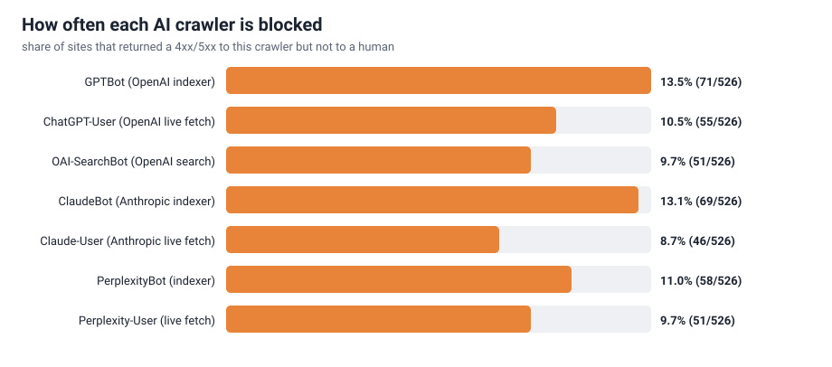

# The Agent-Facing Web — study results

*A first prevalence measurement of agent-directed content divergence: how often, and
in what way, top websites serve an AI crawler a different page than they serve a human.*

**Author:** Tushar Islampure · **Tool:** [agentview](../README.md) · **Method:** v1 (UA-only) · **Run:** Tranco list `74V4X`, 2026-08

---

## TL;DR

- Sample: **1000** top domains from the Tranco ranking; **526** served a human a
  browsable page and are the analysable set.
- **29.5%** (155/526) serve an AI agent a materially different response than a human.
- The split matters more than the total:
  - **16.7%** (88) *block* at least one agent (a 4xx/5xx it doesn't give a human).
  - **14.8%** (78) serve at least one agent an **altered `200 OK` page** — same URL,
    different content, no error to signal the swap. This is the interesting slice.
  - These overlap: some sites block one crawler while quietly altering the page for
    another, so they are not mutually exclusive.
- **18.3%** (96) publish an `llms.txt` / `agents.json` written specifically for AI;
  **5** carried a finding, **0** carried an answer-engine manipulation directive.
- **Overt hidden injection in the wild: ~0%** of the top 526. The scary end of the
  spectrum is real but rare at the top of the web — which is exactly why the demo
  ships a synthetic example to show what it looks like. Differential *serving*,
  however, is common.

---

## Why this measurement didn't exist

Two facts were each known; nobody had put them together at scale:

1. **Agent cloaking is real but only PoC'd.** [SPLX](https://splx.ai/) showed a site
   serving ChatGPT's Atlas browser a poisoned page; ["The Parallel-Poisoned
   Web"](https://arxiv.org/abs/2509.00124) formalized the threat. Neither measured how
   *common* it is in the wild.
2. **The big injection census was single-UA.** The 1.2B-URL wild indirect-injection
   study crawled under one user-agent, so it cannot, by construction, see content that
   only appears when you ask *as an AI crawler*.

agentview closes that gap by fetching each page **as a human and as each AI crawler**
and diffing the results.

## Method

For each URL we issue one `GET` per identity — a desktop-Chrome human plus the seven
documented AI user-agents — changing **only** the `User-Agent` header (and nothing about
TLS, IP, cookies, or timing). We then:

1. Extract visible text from each response and compute human-vs-AI similarity
   (`difflib.SequenceMatcher`).
2. Isolate the **AI-exclusive** content (present for the bot, absent for the human) and
   run detectors over exactly that slice.
3. Subtract any markup-level signal the human is *also* served — the **differential**
   rule that keeps false positives down.
4. Separately fetch and audit the site's agent-instruction files (`llms.txt`,
   `llms-full.txt`, `ai.txt`, `agents.json`, and well-known variants).
5. Reduce to one verdict: `identical` → `benign_divergence` → `manipulative` →
   `adversarial`.

### Sampling and the denominator

Seeds come from the Tranco top ranking with pure infrastructure domains (DNS/CDN/API)
filtered out. Even so, roughly half of the top 1000 doesn't serve a browsable page —
device/API backends that survive the filter, or hosts that block *every* non-browser
client from this network. **Rates are reported over the sites where the human fetch
returned a normal (`<400`) page**, because that's the only population where a
human-vs-AI comparison is meaningful (`analyzed = 526`).

### A note on confounders

Before trusting the divergence numbers I ran a **human-vs-human control** on the big
dynamic sites (Google, Amazon, YouTube, Microsoft, Apple, CNN, BBC, GitHub): two
back-to-back fetches under the *same* human UA came back at **1.0 similarity**. So the
divergence the tool attributes to the User-Agent is genuinely UA-driven, not just a page
changing between requests.

## Results

### 1. The spectrum (independent rates, not a partition)

| among the 526 analyzed sites | sites | % |
| --- | ---: | ---: |
| serve an AI agent a different response | 155 | **29.5%** |
| &nbsp;&nbsp;└ block ≥1 agent (4xx/5xx) | 88 | 16.7% |
| &nbsp;&nbsp;└ serve ≥1 agent an altered `200` page | 78 | 14.8% |
| publish an agent-instruction file | 96 | 18.3% |
| carry an overt manipulation / hidden-injection signal | 0 | 0.0% |

Block and altered-page overlap (a site can treat GPTBot and ClaudeBot differently), so
they don't sum to the 29.5%.

### 2. Per-crawler treatment

The same sites treat different vendors differently. Indexers are blocked more than live
fetchers, and OpenAI's `GPTBot` is blocked most of all (13.5%), while Anthropic's
`Claude-User` live fetcher is blocked least (8.7%). Full table in the generated summary
below.

### 3. What the AI-exclusive content actually was

Across the analyzed set, the differential findings were **552 blocks of CSS-hidden
text** and **11 invisible-unicode clusters** shown to a crawler but not the human —
and **zero** injection phrases, role tokens, or manipulation directives in page content.
In other words: at the top of the web, sites hide and withhold from agents far more than
they actively *poison* them. That's the honest shape of the threat today.

---

## Full generated summary

<!-- BEGIN GENERATED (agentview stats --format markdown) -->
# agentview — study summary

- **URLs scanned:** 1000
- **Analyzed (human fetch OK):** 526 (474 could not be compared)

## Headline

**155 of 526 sites (29.5%) serve AI agents a different response than a human.**

| how they differ | sites | % of analyzed |
| --- | ---: | ---: |
| block the agent (4xx/5xx) | 88 | 16.7% |
| serve an altered 200 page | 78 | 14.8% |

## Verdicts

| verdict | sites |
| --- | ---: |
| benign_divergence | 211 |
| identical | 469 |
| error | 320 |

## Per AI crawler

| crawler | served same | different | blocked | failed | % blocked |
| --- | ---: | ---: | ---: | ---: | ---: |
| GPTBot (OpenAI indexer) | 391 | 57 | 71 | 7 | 13.5% |
| ChatGPT-User (OpenAI live fetch) | 399 | 59 | 55 | 13 | 10.5% |
| OAI-SearchBot (OpenAI search) | 412 | 53 | 51 | 10 | 9.7% |
| ClaudeBot (Anthropic indexer) | 394 | 55 | 69 | 8 | 13.1% |
| Claude-User (Anthropic live fetch) | 417 | 54 | 46 | 9 | 8.7% |
| PerplexityBot (indexer) | 402 | 60 | 58 | 6 | 11.0% |
| Perplexity-User (live fetch) | 412 | 55 | 51 | 8 | 9.7% |

## Agent-instruction files

- Sites publishing any (llms.txt / agents.json / …): **96** (18.3%)
- …with any finding: **5**
- …with a manipulation directive: **0**

## Finding types

| type | count |
| --- | ---: |
| hidden_html | 552 |
| invisible_unicode | 11 |
<!-- END GENERATED -->

---

## Honesty & limitations

- **Lower bound.** UA-only detection undercounts: fingerprinting sites show us the human
  page regardless of the UA we claim.
- **Raw HTML, not JS-rendered.** SPAs can look sparse in both views; the diff is strongest
  on server-rendered content. A headless-Chromium human baseline is the planned v2.
- **Heuristic findings.** High-recall by design; each carries a snippet to adjudicate.
  Zero-width characters are only flagged as a cluster (a single incidental one is
  ignored); bidi-control and unicode-tag characters flag on first sight.
- **Small scary slice.** Overt injection is ~0% at the top of the web; benign blocking
  and differential serving dominate. The contribution is measuring the *whole spectrum*
  honestly, not inflating the scary number.
- **No claims of adoption.** This is an independent measurement, not an endorsed benchmark.

## Reproduce

See [../study/README.md](../study/README.md). The full per-site dataset is
[../study/results/tranco_top1000.jsonl](../study/results/tranco_top1000.jsonl).
